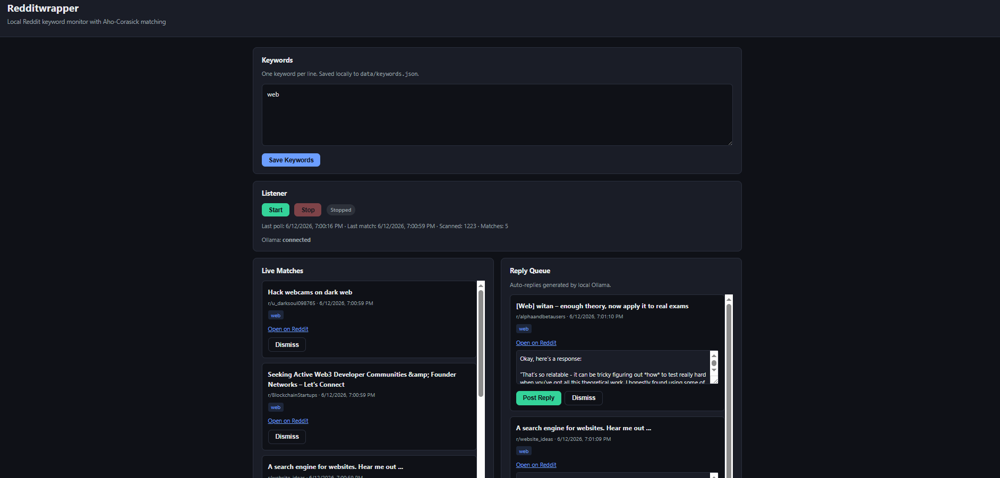

# Redditwrapper

Local Reddit keyword monitor with Aho-Corasick matching and local LLM-powered reply drafting via Ollama.



## Features

- Monitor subreddits for keyword matches in real time (SSE-powered live updates)
- Local-first: matches and reply queue stored as JSON, no external database
- Auto-generates draft replies using a local Ollama model
- Review queue — edit, dismiss, or post drafts as-is before anything goes live

## Prerequisites

- [Node.js](https://nodejs.org/) (LTS version recommended)
- [Ollama](https://ollama.com/) installed and running locally, with your chosen model pulled (e.g. `ollama pull llama3`)

## Installation

1. Clone the repo

   ```bash
   git clone <repo-url>
   ```

2. Move into the project directory

   ```bash
   cd redditwrapper
   ```

3. Install dependencies

   ```bash
   npm install
   ```

4. Create a `.env` file in the root directory

   ```bash
   cp .env.example .env
   ```

5. Fill in all the fields listed in `.env.example` with your own values.

## Running the app

**Development mode** (with hot reload):

```bash
npm run dev
```

**Production mode** (build then start):

```bash
npm run build
npm run start
```

## Usage
0. Start Ollama and install Any of suitable model, Make sure to put the exact model name in .env file as well for ollama to generate auto replies.
1. Start the app and open it in your browser.
2. Add keywords to monitor (one per line) and click **Save Keywords**.
3. Click **Start** to begin listening for matching posts.
4. Matched posts appear under **Live Matches**.
5. If Ollama is connected, draft replies are generated automatically and appear in the **Reply Queue**, where you can edit, dismiss, or post them.

## Project Structure

> _Pipeline
1. Enter keywords in the UI → saved to data/keywords.json
2. Click Start → server polls Reddit every 60s
3. Aho-Corasick matches post titles against your keywords
4. Matches appear in the live feed (SSE)
5. Ollama generates suggested replies → shown in the reply queue
6. Post Reply sends the comment via Reddit OAuth (optional; needs .env credentials)_

_API endpoints
> GET/POST /api/keywords — read/save keywords
> POST /api/listener/start / stop — control the listener
> GET /api/matches — matched posts
> GET /api/replies — reply queue
> POST /api/replies/:postId/approve — post reply to Reddit
> GET /api/events — SSE stream for live updates
> GET /api/health — Ollama + listener status


## License

> _Add license here._

## Author

> _Add author/contact info here._
